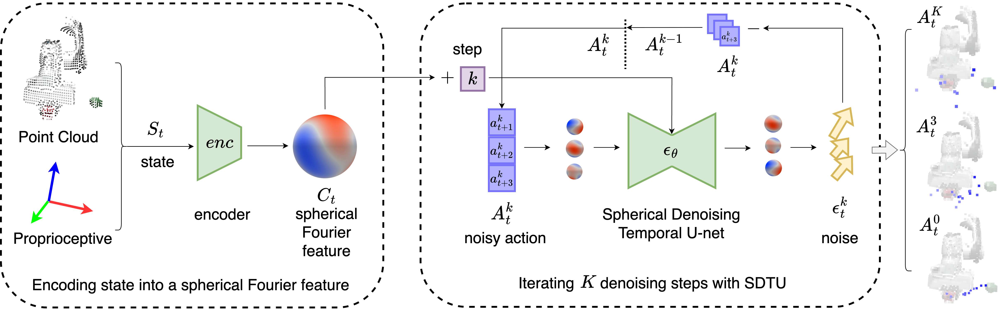

# Spherical Diffusion Policy
By [Xupeng Zhu](https://zxp-s-works.github.io/), [Fan Wang](https://faninedinburgh.wixsite.com/mysite-1/publications), [Robin Walters](https://www.robinwalters.com/), and [Jane Shi]()

[](https://paperswithcode.com/sota/robot-manipulation-on-mimicgen?p=se-3-equivariant-diffusion-policy-in)

Official implementation for [**Spherical Diffusion Policy: A SE(3) Equivariant Visuomotor Policy with Spherical Fourier Representation**](https://openreview.net/forum?id=U5nRMOs8Ed), to appear at **ICML 2025**.

[Arxiv](https://arxiv.org/abs/2507.01723) ｜ [5min summary video](https://recorder-v3.slideslive.com/?share=102381&s=e55f418c-393e-451f-a47e-c25b41d009e5) | [OpenReview](https://openreview.net/forum?id=U5nRMOs8Ed)



Spherical Diffusion Policy (SDP) is a SE(3) equivariant and T(3) invariant visuomotor policy that leverages spherical Fourier representations to achieve strong 3D generalization in robotic manipulation tasks. SDP introduces three key components:
1. **Spherical Fourier Representations** for encoding the robot's state and actions with continuous rotational equivariance.
2. **Spherical FiLM Conditioning** to inject scene embeddings from the vision encoder into the denoising process in an equivariant manner.
3. **Spherical Denoising Temporal Unet (SDTU)** that supports spatiotemporal equivariant denoising of trajectories.

Our method generalizes well across diverse 3D scene configurations and is benchmarked on 20 simulation tasks using [MimicGen](https://github.com/NVlabs/mimicgen_environments) and 5 physical single arm or bi-manual robot tasks, consistently outperforming strong baselines like EquiDiff, DiffPo, and ACT.

This repository includes code for:
- Benchmarking SDP on the MimicGen suite with SE(3) randomized tasks.
- Training and evaluation scripts for all simulation benchmarks.
- Dataset generation and preprocessing utilities.

[//]: # (If you find this work helpful, please consider citing our paper &#40;citation to be added upon publication&#41;.)

---
## Step1: Installation
1.  Install the following apt packages for mujoco:
    ```bash
    sudo apt install -y libosmesa6-dev libgl1-mesa-glx libglfw3 patchelf
    ```
1. Install gfortran (dependency for escnn) 
    ```bash
    sudo apt install -y gfortran
    ```

1. Install [Mambaforge](https://github.com/conda-forge/miniforge#mambaforge) (recommended) or Anaconda
1. Clone this repo
    ```bash
    git clone https://github.com/amazon-science/Spherical_Diffusion_Policy.git
    cd sdp
    ```
1. Install environment:
    ```bash
    mamba env create -f conda_environment.yaml
    conda activate sdp
    ```
    or: 
    ```bash
    conda env create -f conda_environment.yaml
    conda activate sdp
    ```
1. Force reinstall lie-learn (due to a known [issue](https://github.com/AMLab-Amsterdam/lie_learn/issues/16#issuecomment-824856075))
    ```bash
    pip uninstall lie-learn
    pip install git+https://github.com/AMLab-Amsterdam/lie_learn@07469085ac0fd4550fd26ff61cb10bb1e92cead1
    ```
1. Install mimicgen:
    ```bash
    cd ..
    git clone https://github.com/NVlabs/mimicgen_environments.git
    cd mimicgen_environments
    git checkout 45db4b35a5a79e82ca8a70ce1321f855498ca82c
    pip install -e .
    cd ../sdp
    ```
1. Make sure mujoco version is 2.3.2 (required by mimicgen)
    ```bash
    pip list | grep mujoco
    ```

## Step2: Preparing Dataset
### Download Dataset for 12 MimicGen tasks (with SE(2) initialization, _d1 and _d2 tasks):
```bash
# Download all datasets
python sdp/scripts/download_datasets.py --tasks stack_d1 stack_three_d1 square_d2 threading_d2 coffee_d2 three_piece_assembly_d2 hammer_cleanup_d1 mug_cleanup_d1 kitchen_d1 nut_assembly_d0 pick_place_d0 coffee_preparation_d1
# Alternatively, download one (or several) datasets of interest, e.g.,
python sdp/scripts/download_datasets.py --tasks stack_d1
```

### [Optional] Preparing tasks and generate dataset for 8 MimicGen tasks with SE(3) initialization (_d3 and _d4 tasks):
Clone the custom repositories:
```
git clone https://github.com/ZXP-S-works/robosuite.git -b se3
git clone https://github.com/ZXP-S-works/robomimic.git -b for_mimicgen
git clone https://github.com/ZXP-S-works/mimicgen.git -b for_mimicgen
```
Go to each folder and install all of them:
```
pip install -e .
```
To generate demo with img obs, follow: https://mimicgen.github.io/docs/tutorials/reproducing_experiments.html


### Generating Point Cloud and Voxel Observation

```bash
# Template
python sdp/scripts/dataset_states_to_obs.py --input data/robomimic/datasets/${dataset}/${dataset}.hdf5 --output data/robomimic/datasets/${dataset}/${dataset}_pc.hdf5 --num_workers=12
# Replace [dataset] and [n_worker] with your choices.
# E.g., use 24 workers to generate point cloud and voxel observation for stack_d1
python sdp/scripts/dataset_states_to_obs.py --input data/robomimic/datasets/stack_d1/stack_d1.hdf5 --output data/robomimic/datasets/stack_d1/stack_d1_pc.hdf5 --num_workers=24
```

### Convert Action Space in Dataset
The downloaded dataset has a relative action space. To train with absolute action space, the dataset needs to be converted accordingly
```bash
# Template
python sdp/scripts/robomimic_dataset_conversion.py -i data/robomimic/datasets/${dataset}/${dataset}.hdf5 -o data/robomimic/datasets/${dataset}/${dataset}_abs.hdf5 -n 12
# Replace [dataset] and [n_worker] with your choices.
# E.g., convert stack_d1_pc with 12 workers
python sdp/scripts/robomimic_dataset_conversion.py -i data/robomimic/datasets/stack_d1/stack_d1_pc.hdf5 -o data/robomimic/datasets/stack_d1/stack_d1_pc_abs.hdf5 -n 12
```

[//]: # (python sdp/scripts/dataset_states_to_obs.py --input data/robomimic/datasets/${dataset}/${dataset}.hdf5 --output data/robomimic/datasets/${dataset}/${dataset}_pc.hdf5 --num_workers=12 && python sdp/scripts/robomimic_dataset_conversion.py -i data/robomimic/datasets/${dataset}/${dataset}.hdf5 -o data/robomimic/datasets/${dataset}/${dataset}_abs.hdf5 -n 12)

## Step3: Training SDP
Training SDP in `stack_d1`:
```
python train.py --config-name=sdp_ddpm_5layer task_name=stack_d1
```
Training SDP in other tasks, replace `stack_d1` with `stack_three_d1`, `square_d2`, `threading_d2`, `coffee_d2`, `three_piece_assembly_d2`, `hammer_cleanup_d1`, `mug_cleanup_d1`, `kitchen_d1`, `nut_assembly_d0`, `pick_place_d0`, `coffee_preparation_d1`. Notice that the corresponding dataset should be downloaded already. If training absolute pose control, the data conversion is also needed.

To run environments on CPU (to save GPU memory), use `osmesa` instead of `egl` through `MUJOCO_GL=osmesa PYOPENGL_PLATFORM=osmesa`, e.g.,
```bash
MUJOCO_GL=osmesa PYOPENGL_PLATFORM=osmesa python train.py --config-name=train_equi_diffusion_unet_abs task_name=stack_d1
```

Spherical Diffusion Policy requires around 22G GPU memory to run with batch size of 32 (default). To reduce the GPU usage, consider training with smaller batch size and/or reducing the hidden dimension
```bash
# to train with batch size of 64 and hidden dimension of 64
MUJOCO_GL=osmesa PYOPENGL_PLATFORM=osmesa python train.py --config-name=sdp_ddpm_5layer task_name=stack_d1 dataloader.batch_size=16
```

[Optional] Training SDP in 12 MimicGen tasks using bash script (the training bash scripts are located in `/scripts`.):
```
./scripts/train_sdp_v2_4tasks.sh
./scripts/train_sdp_v2_8tasks.sh
```

[Optional] Training 8 MimicGen tilted table tasks (d3 -> [0, 15] tilt, d4 -> [0, 30] tilt):
```
./scripts/train_4tilted_table_tasks_sdp.sh
```

[Optional] Training ablation experiments:
```
./scripts/train_sdp_v2_ablation.sh
```

[Optional] Training sample efficiency experiments:
```
./scripts/train_sdp_v2_sample_efficiency.sh
```

[Optional] Training EquiDiff baseline with image observation
To train Equivariant Diffusion Policy (with absolute pose control) in Stack D1 task:
```bash
python train.py --config-name=train_equi_diffusion_unet_abs task_name=stack_d1
```
[Optional] Training EquiDiff baseline with relative pose control instead:
```bash
python train.py --config-name=train_equi_diffusion_unet_rel task_name=stack_d1
```
[Optional] Training EquiDiff baseline with voxel observation
To train Equivariant Diffusion Policy (with absolute pose control) in Stack D1 task:
```bash
python train.py --config-name=train_equi_diffusion_unet_voxel_abs task_name=stack_d1
```

# Citation
If you find this code useful for your research, please consider citing our paper [**Spherical Diffusion Policy: A SE(3) Equivariant Visuomotor Policy with Spherical Fourier Representation**](https://openreview.net/forum?id=U5nRMOs8Ed).
```
@inproceedings{
zhu2025seequivariant,
title={{SE}(3)-Equivariant Diffusion Policy in Spherical Fourier Space},
author={Xupeng Zhu and Fan Wang and Robin Walters and Jane Shi},
booktitle={Forty-second International Conference on Machine Learning},
year={2025},
url={https://openreview.net/forum?id=U5nRMOs8Ed}
}
```

## License
This repository is released under the MIT license. See [LICENSE](LICENSE) for additional details.

## Acknowledgement
* Our repo adapted [EquiformerV2](https://github.com/atomicarchitects/equiformer_v2)
* Our repo is heavily built upon the original [Equivariant Diffusion Policy](https://github.com/pointW/equidiff)
* Our repo is heavily built upon the original [Diffusion Policy](https://github.com/real-stanford/diffusion_policy)
* Our ACT baseline is adapted from its [original repo](https://github.com/tonyzhaozh/act)

## Gotcha
Installing dgl, change the torch version and cuda version accordingly:
```
mamba install -c dglteam/label/th21_cu118 dgl
```

Install pkg for EquiformerV2:
```
mamba install pytorch-cluster pytorch-scatter -c pyg
```
or
```
mamba install pytorch_cluster pytorch_scatter
```
Then
```
mamba install e3nn
pip install torch_geometric
```

For the error in server "AttributeError: module 'OpenGL.EGL' has no attribute 'EGLDeviceEXT'", consider use headless mode by [setting Pyogl.](https://github.com/google-deepmind/dm_control/issues/129)
```
export MUJOCO_GL=osmesa && export PYOPENGL_PLATFORM=osmesa
```

stove.xml does not exist: install the zoo with `pip install -e .`

converting dataset from image to pcd to abs in background (especially useful when running in AWS EC2):
```
sudo chmod +777 ./img2pcd2abs.sh
nohup ./img2pcd2abs.sh
```

### Setting up a new instance in AWS EC2:
```
sudo apt install -y libosmesa6-dev libgl1-mesa-glx libglfw3 patchelf
conda init
```
then reopen the terminal to install pkgs.
```
mamba install pytorch-cluster pytorch-scatter -c pyg -y \
&& mamba install -c dglteam/label/th21_cu118 dgl -y \
&& mamba install e3nn -y \
&& pip install torch_geometric
cd /home/ubuntu/step/sdp && conda activate sdp && export MUJOCO_GL=osmesa && export PYOPENGL_PLATFORM=osmesa
cd ..
git clone 
cd ../robosuite-task-zoo
pip install -e .
git clone https://github.com/NVlabs/mimicgen_environments.git
cd mimicgen_environments
git checkout 45db4b35a5a79e82ca8a70ce1321f855498ca82c
pip install -e .
cd ../sdp/scripts
```
run this command to initialize when open a new AWS EC2 terminal:
```
cd /home/ubuntu/step/sdp/scripts && conda activate sdp && export MUJOCO_GL=osmesa && export PYOPENGL_PLATFORM=osmesa
```

For the error in server "AttributeError: module 'OpenGL.EGL' has no attribute 'EGLDeviceEXT'", consider use headless mode by [setting Pyogl.](https://github.com/google-deepmind/dm_control/issues/129)
```
export MUJOCO_GL=osmesa && export PYOPENGL_PLATFORM=osmesa
```

ModuleNotFoundError: No module named 'robosuite....'
=> make sure you uninstalled completely robosuite from site_packages dir

### Multi-GPU Training

Use accelerate launch:

One time setup step for multi-GPU training: - activate `robodiff` and enter `accelerate config` in the terminal. Follow the prompts in the terminal to setup the multi-GPU training config. What we usually do is local machine, multi-GPU training, 8 GPUs, all GPUs used, and NO to most other prompts.

To begin, run `accelerate config` by entering `accelerate config` in the terminal after activating `robodiff` environment. Then, use the following command to start multi-GPU training:

```bash
accelerate launch --num_processes 8 train.py --config-name=unet_ambidex_workspace task=real_pick_image
```

If the port is occupied, set `--main_process_port 10001` etc.
